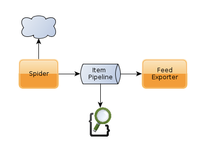

# scrapyTutorial
scrapy ( web crawling tutorial )

## 데이터 흐름



## 설치하기
### install virtualenv
virtualenv 환경에 설치하는 것을 권장한다.
```
$sudo pip install virtualenv
```

### activate script
virtual env를 생성하고 활성화한다.
```
$virtualenv ENV
$source ./ENV/bin/activate
```

### install scrapy
scrapy 패키지를 설치한다. (https://github.com/scrapy/scrapy)
```
$pip install Scrapy
```

### install elasticSearch
elasticSearch 패키지를 설치한다. (https://github.com/knockrentals/scrapy-elasticsearch)
```
$pip3 install ScrapyElasticSearch
```

### install Scrapy-UserAgents
user-agent 설정 패키지를 설치한다. (https://github.com/grammy-jiang/scrapy-useragents)
```
$pip install scrapy-useragents
```

### configurate setting.py
settings.py에 # Elastic Search 부분을 설정한다.
```
# -----------------------------------------------------------------------------
# Elastic Search
# -----------------------------------------------------------------------------
ITEM_PIPELINES = {
  'scrapyelasticsearch.scrapyelasticsearch.ElasticSearchPipeline': 500
}

ELASTICSEARCH_SERVERS = ['localhost:9200']
ELASTICSEARCH_INDEX = 'scrapy'
ELASTICSEARCH_TYPE = 'items'
```

## 실행하기
```
#scrapy crawl land
```